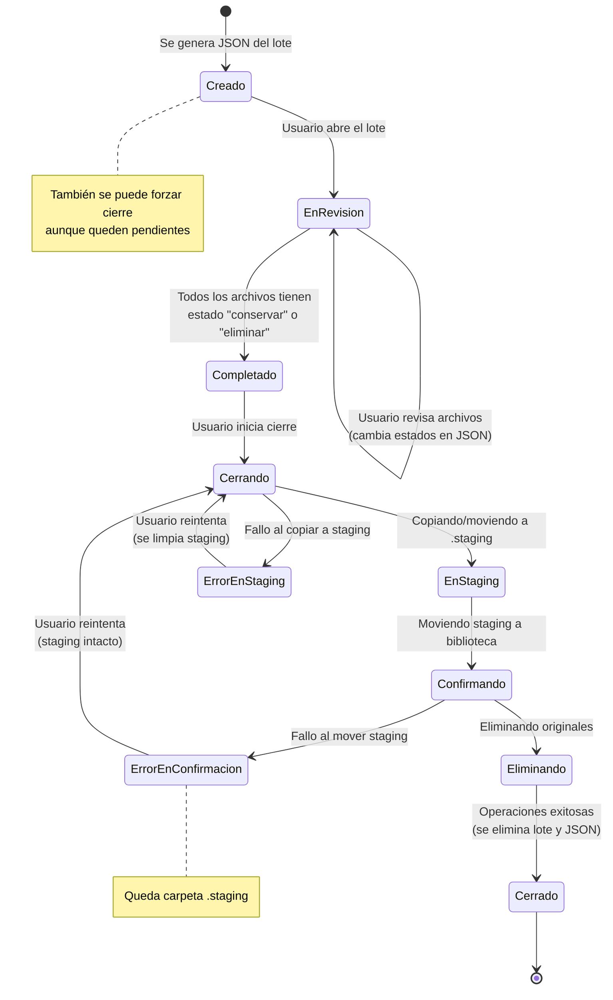
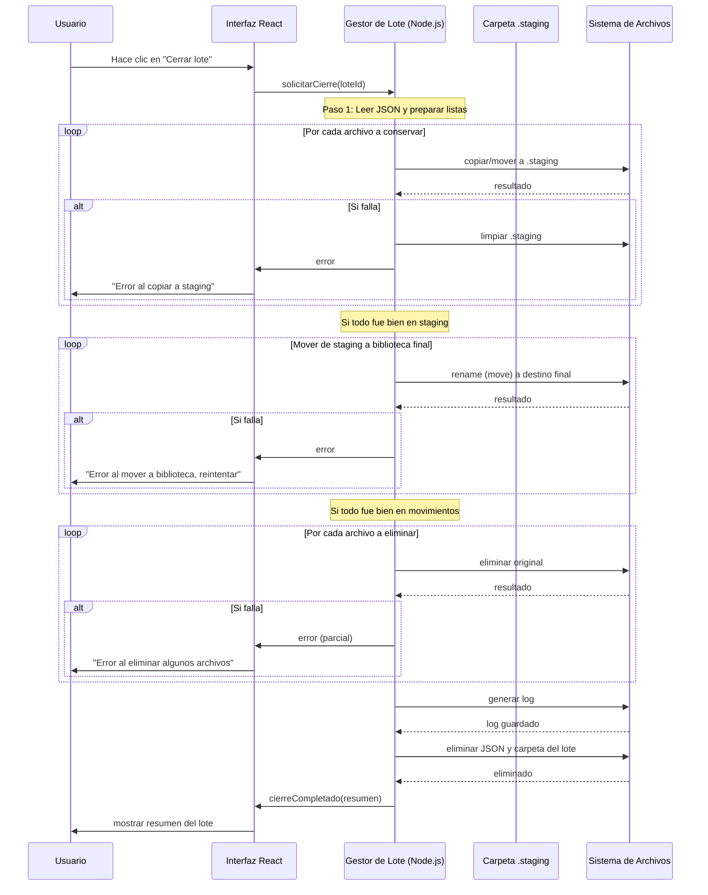
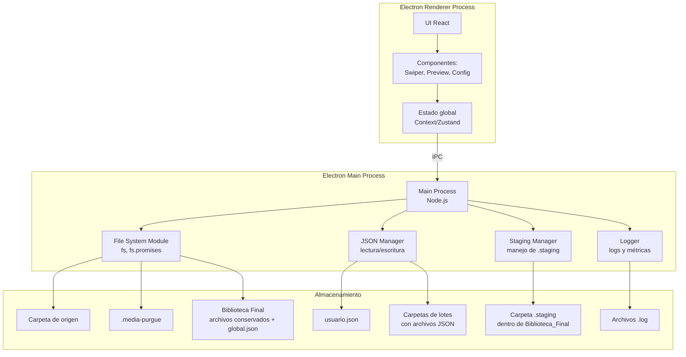

# Media Purgue


Aplicación para revisar y limpiar grandes colecciones de fotos y videos mediante lotes JSON, con un flujo transaccional seguro y una UI de revisión rápida (swipe o teclado).

Rápido (Quick start):

```bash
# instalar deps
npm install

# modo desarrollo (renderer + main + electron)
npm run dev

# build + empaquetado (Windows x64 NSIS)
npm run dist:win
```

Descargas y binarios: revisa la sección *Releases* del repositorio (se incluye el instalador `Media Purgue Setup <version>.exe`).




### **Secuencia para el cierre transaccional**



### **Componentes (arquitectura)**



---

## **Mockups**

### Pantalla principal (inicio)

```
┌─────────────────────────────────────────────────────┐
│  📸 Media Purge                                      │
├─────────────────────────────────────────────────────┤
│                                                     │
│  📁 Carpeta a analizar:                              │
│  ┌───────────────────────────────────────────────┐ │
│  │                                                 │ │
│  │ [Seleccionar carpeta...]                       │ │
│  └───────────────────────────────────────────────┘ │
│                                                     │
│  ⚙️ Configuración actual (toca el icono para cambiar)│
│  ┌───────────────────────────────────────────────┐ │
│  │  Tamaño de lote: 100 imágenes | 30 videos     │ │
│  │  Criterio: Fecha de creación                  │ │
│  │  Nombre biblioteca: Biblioteca_Final          │ │
│  │  Ubicación: (misma carpeta de origen)         │ │
│  │  Incluir subcarpetas: Sí                       │ │
│  └───────────────────────────────────────────────┘ │
│                                                     │
│  📊 Estimación de lotes:                            │
│  ┌───────────────────────────────────────────────┐ │
│  │  (se actualizará al seleccionar carpeta)      │ │
│  └───────────────────────────────────────────────┘ │
│                                                     │
│  📍 La biblioteca final se creará en la ubicación   │
│     configurada (por defecto, junto a la carpeta    │
│     de origen).                                      │
│                                                     │
│  ┌─────────────────────────────────────────────┐   │
│  │              ▶ Iniciar proceso               │   │
│  └─────────────────────────────────────────────┘   │
└─────────────────────────────────────────────────────┘
```

### Ventana de configuración (modal)

```
┌─────────────────────────────────────────────────────┐
│  ⚙️ Configuración avanzada                           │
├─────────────────────────────────────────────────────┤
│                                                     │
│  📦 Tamaño de lote:                                 │
│     Imágenes:  ┌─────┐  Videos:  ┌─────┐           │
│                │ 100 │           │ 30  │           │
│                └─────┘           └─────┘           │
│                                                     │
│  🔽 Criterio de orden:                              │
│     ◎ Fecha de creación    ○ Tamaño                 │
│                                                     │
│  📛 Nombre de biblioteca final:                     │
│  ┌───────────────────────────────────────────────┐ │
│  │ Biblioteca_Final                               │ │
│  └───────────────────────────────────────────────┘ │
│                                                     │
│  📂 Incluir subcarpetas:  [✔️] Sí                    │
│                                                     │
│  📍 Ubicación de la carpeta final:                  │
│  ┌───────────────────────────────────────────────┐ │
│  │ C:/Users/Usuario/                             │ │
│  └───────────────────────────────────────────────┘ │
│  [ Examinar... ]                                   │
│                                                     │
│  ┌─────────┐  ┌─────────┐                          │
│  │ Cancelar│  │ Guardar │                          │
│  └─────────┘  └─────────┘                          │
└─────────────────────────────────────────────────────┘
```

### Pantalla de revisión (swipe)

```
┌─────────────────────────────────────────────────────┐
│  📌 Lote: Imágenes 0001                     🔄 3/100│
├─────────────────────────────────────────────────────┤
│                                                     │
│  ┌─────────────────────────────────────────────┐   │
│  │                                             │   │
│  │              🖼️ Vista previa                 │   │
│  │               de imagen/video               │   │
│  │                                             │   │
│  │         [Cargando desde ruta original]      │   │
│  │                                             │   │
│  └─────────────────────────────────────────────┘   │
│                                                     │
│  📄 Nombre: vacaciones.jpg                          │
│  💾 Tamaño: 4.2 MB   📅 Fecha: 2023-08-15          │
│                                                     │
│  ┌──────────┐    ┌────────┐    ┌──────────┐       │
│  │  ← Elim. │    │ Saltar │    │ Conservar→│       │
│  └──────────┘    └────────┘    └──────────┘       │
│                                                     │
│  ⌨️ Atajos:  ← (Eliminar)  → (Conservar)            │
│            ⬆️ ⬇️ (Navegar)  Enter (Conservar)       │
│            Delete (Eliminar)                        │
└─────────────────────────────────────────────────────┘
```

### Pantalla de resumen de lote (al cerrar)

```
┌─────────────────────────────────────────────────────┐
│  📊 Resumen del lote 0001                           │
├─────────────────────────────────────────────────────┤
│                                                     │
│  ✅ Conservados:  45 archivos  (120 MB)             │
│  🗑️ Eliminados:   55 archivos  (180 MB)             │
│                                                     │
│  ┌─────────────────────────────────────────────┐   │
│  │  Detalles:                                   │   │
│  │  - 30 imágenes conservadas (80 MB)           │   │
│  │  - 15 videos conservados (40 MB)             │   │
│  │  - 40 imágenes eliminadas (120 MB)           │   │
│  │  - 15 videos eliminados (60 MB)              │   │
│  └─────────────────────────────────────────────┘   │
│                                                     │
│  ┌─────────────┐  ┌─────────────┐                  │
│  │ Ver detalles│  │ Continuar   │                  │
│  └─────────────┘  └─────────────┘                  │
└─────────────────────────────────────────────────────┘
```

### Pantalla de progreso global (al finalizar)

```
┌─────────────────────────────────────────────────────┐
│  🎉 ¡Proceso completado!                             │
├─────────────────────────────────────────────────────┤
│                                                     │
│  Resumen global:                                    │
│                                                     │
│     Archivos procesados: 323                        │
│     Espacio liberado:    320 MB                     │
│     Espacio en biblioteca: 1.25 GB                  │
│                                                     │
│  📁 Biblioteca final ubicada en:                    │
│  ┌───────────────────────────────────────────────┐ │
│  │ C:/Users/Usuario/Biblioteca_Final             │ │
│  └───────────────────────────────────────────────┘ │
│                                                     │
│  🧹 La carpeta temporal .media-purgue ha sido       │
│     eliminada.                                      │
│                                                     │
│  ┌─────────────┐  ┌─────────────────────────────┐  │
│  │   Cerrar    │  │  Abrir Biblioteca_Final 📂  │  │
│  └─────────────┘  └─────────────────────────────┘  │
└─────────────────────────────────────────────────────┘
```
