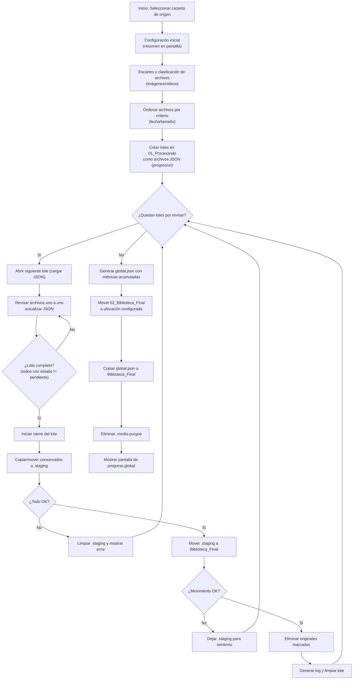
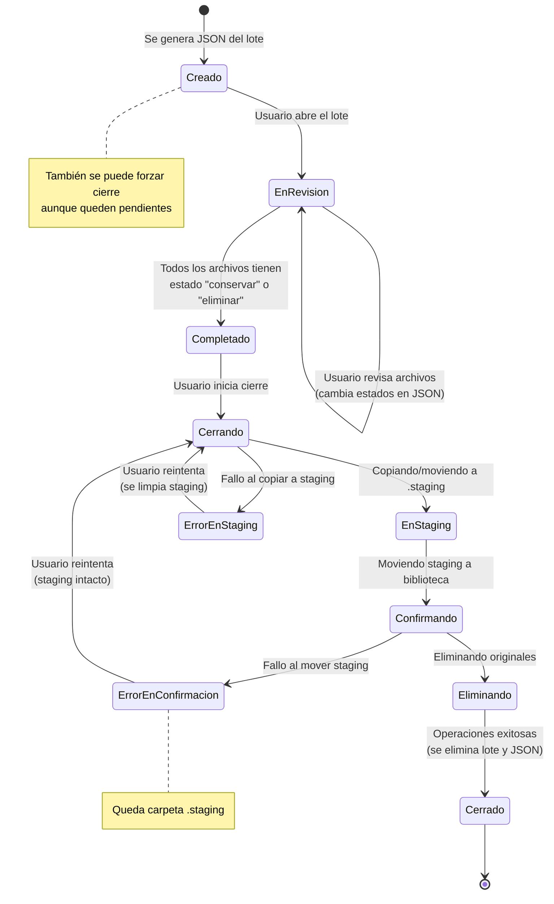
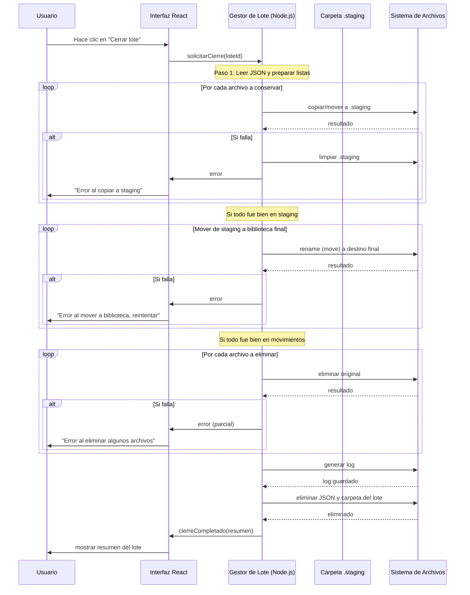
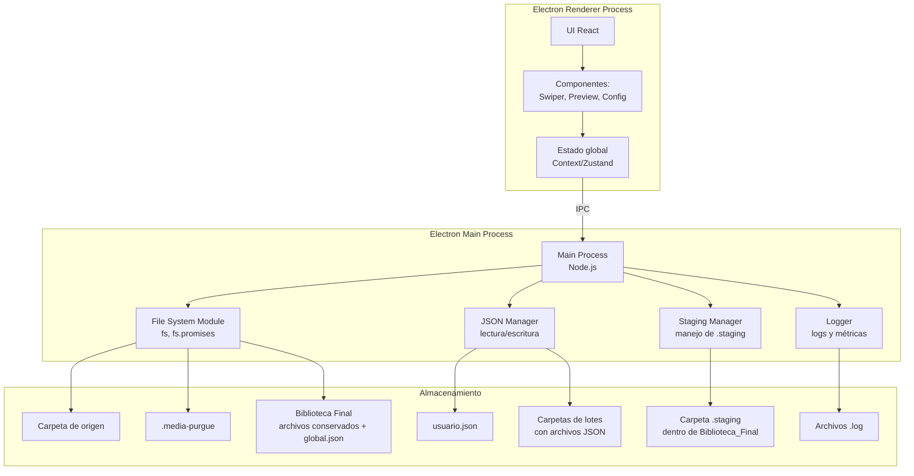

# Media Purgue — Documentación del proyecto

Este documento reúne la especificación, diseño y flujo de trabajo de la aplicación "Media Purgue".

## Enunciado

### Objetivo

Eliminar una gran cantidad de fotos y videos de forma:

- **Eficiente para el sistema** - Sin duplicar archivos binarios
- **Cómoda para el usuario** - Interfaz intuitiva con swipe estilo Tinder
- **Escalable a miles de archivos** - Sistema de lotes JSON
- **Segura (sin riesgo de borrar lo correcto)** - Operaciones transaccionales con staging

### Contexto

En lugar de eliminar archivo por archivo, se implementa un sistema basado en lotes cerrados, donde el usuario decide manualmente qué conservar con el método swipe estilo Tinder.

El usuario selecciona una carpeta de origen (por ejemplo, "Fotos" o "Videos") que contiene todos los archivos a revisar. Dentro de esa carpeta se creará una carpeta oculta llamada `.media-purgue` que contendrá toda la estructura temporal del proyecto.

Al finalizar, la biblioteca con los archivos conservados se moverá al mismo nivel que la carpeta de origen (o a la ubicación configurada), y la carpeta temporal se eliminará.

Se ofrecerán tamaños de lote por defecto distintos para imágenes y videos. El usuario podrá modificar la configuración por defecto a través de una ventana de configuración accesible desde la pantalla principal.

### Optimizaciones clave

- Los lotes no contendrán archivos físicos, sino archivos JSON con los metadatos de los archivos a revisar (incluyendo la ruta original). Esto evita duplicados y problemas de permisos.
- La Biblioteca Final será la única que contendrá los archivos realmente conservados.
- Se utilizará un archivo JSON por lote para registrar el estado de cada archivo, incluyendo su ruta original y metadatos adicionales.
- Se utilizará un archivo de configuración del usuario JSON para guardar los parámetros de lote y criterios de creación.
- Al finalizar cada lote, se generará un log con los archivos conservados, eliminados y el espacio liberado/ocupado por tipo de archivo.
- Para garantizar la integridad en caso de interrupción, se usará una carpeta de staging (`.staging`) dentro de `02_Biblioteca_Final` durante el cierre de cada lote, permitiendo operaciones atómicas.
- Al finalizar todo el proceso, se generará un resumen global (`global.json`) que se guardará dentro de la Biblioteca Final.

## Estructura general (dentro de la carpeta de origen)

```
Carpeta_de_origen/
 ├── (archivos y subcarpetas originales)
 └── .media-purgue/                          # Carpeta oculta temporal
      ├── 01_Procesando/                       # Lotes (solo archivos JSON)
      │     ├── Imagenes_Lote_0001/       │     │     └── lote_0001.json            # Metadatos del lote
      │     ├── Imagenes_Lote_0002/
      │     │     └── lote_0002.json
      │     └── Videos_Lote_0001/
      │           └── lote_0001.json
      ├── 02_Biblioteca_Final/                 # Temporal, se llena durante el proceso
      │     ├── Imagenes/
      │     ├── Videos/
      │     └── .staging/                       # Para cierre transaccional
      ├── Config/                               # Configuración del usuario
      │     └── usuario.json
      └── Logs/                                 # Logs por lote
            ├── lote_0001.log
            └── lote_0002.log
```

### Al finalizar todos los lotes:

- La carpeta `02_Biblioteca_Final` se moverá a la ubicación configurada (por defecto, al mismo nivel que la carpeta de origen) y se renombrará según la configuración (ej. `Biblioteca_Final`).
- El archivo `global.json` (resumen global) se generará y se guardará dentro de `Biblioteca_Final`.
- Toda la carpeta `.media-purgue` se eliminará.

## Parámetros de usuario

Los parámetros se configuran en una ventana modal accesible desde la pantalla principal (icono de tuerca). Los valores por defecto son:

| Parámetro | Descripción | Valor por defecto |
| --- | --- | --- |
| Tamaño del lote (imágenes) | Número de imágenes por lote | 100 |
| Tamaño del lote (videos) | Número de videos por lote | 30 |
| Criterio de creación de lotes | Orden de los archivos dentro de los lotes | fecha_creación |
| Nombre de la biblioteca final | Nombre de la carpeta que contendrá los archivos conservados | Biblioteca_Final |
| Ubicación de la carpeta final | Ruta donde se guardará la biblioteca final (mismo nivel que carpeta de origen) | ../ |
| Incluir subcarpetas | Si se deben procesar archivos dentro de subcarpetas | Sí |

Estos valores se guardan en `.media-purgue/Config/usuario.json`.

## Flujo detallado

### 0. Selección de carpeta de origen

El usuario selecciona la carpeta que contiene las fotos y videos a procesar. Dentro de ella se crea la carpeta oculta `.media-purgue`.

### 1. Configuración de usuario

En la pantalla principal se muestra un resumen de la configuración actual. Al hacer clic en el icono de tuerca, se abre una ventana modal donde el usuario puede modificar los parámetros. Al guardar, se actualiza el archivo de configuración.

### 2. Escaneo y clasificación

Se recorre la carpeta de origen (y subcarpetas si está habilitado) identificando archivos de imagen y video.

Para cada archivo, se extraen metadatos: nombre, ruta completa, tamaño, fecha de modificación, tipo (imagen/video).

Para optimizar el inicio de la experiencia del usuario, se pueden generar los primeros lotes de forma inmediata (por ejemplo, los dos primeros de cada tipo) mientras el resto se procesa en segundo plano. Esto permite que el usuario comience a revisar sin esperar a que termine el escaneo completo.

Los metadatos se almacenan en una estructura de datos que permita la paginación o generación progresiva de lotes.

### 3. Creación de la biblioteca final temporal

Se crea `.media-purgue/02_Biblioteca_Final/Imagenes` y `02_Biblioteca_Final/Videos`, así como la carpeta `.staging` dentro de ella.

### 4. Creación de lotes (archivos JSON)

Se ordenan las listas de imágenes y videos según el criterio elegido (fecha o tamaño).

Se dividen en lotes del tamaño configurado para cada tipo.

Para cada lote:

- Se crea una carpeta en `01_Procesando` con el nombre `Imagenes_Lote_XXXX` o `Videos_Lote_XXXX`.
- Se genera un archivo JSON `lote_XXXX.json` con la siguiente estructura:

```json
{
  "lote_id": 1,
  "tipo": "imagenes",
  "criterio": "fecha_creacion",
  "fecha_creacion": "2024-01-01T10:00:00Z",
  "archivos": [
    {
      "nombre": "vacaciones.jpg",
      "ruta_original": "/ruta/completa/al/original/vacaciones.jpg",
      "tamano_bytes": 4200000,
      "fecha_modificacion": "2023-08-15T14:30:00Z",
      "estado": "pendiente",
      "orden": 1
    }
  ]
}
```

- `estado` puede ser: `pendiente`, `conservar`, `eliminar`.
- `orden` es el número de orden dentro del lote.

### 5. Revisión manual

El usuario abre un lote desde la interfaz. La aplicación lee el JSON correspondiente y muestra un archivo por vez, cargando la vista previa directamente desde `ruta_original`.

**Opciones:**
- Swipe a la derecha, botón ✓ o tecla Enter → marcar como "conservar" (actualiza el estado en el JSON)
- Swipe a la izquierda, botón ✗ o tecla Delete → marcar como "eliminar"
- Navegación con teclas (← →) o botones de anterior/siguiente para revisar sin decidir

**Características:**
- Vista previa de imágenes y videos (carga progresiva, lazy loading)
- Se puede retroceder y cambiar la decisión de cualquier archivo
- El JSON se actualiza en tiempo real (cada cambio se guarda en disco)
- No se mueven archivos físicos durante la revisión, solo se actualiza el JSON

### 6. Cierre del lote

Cuando todos los archivos del lote tienen estado distinto de "pendiente", se inicia el cierre (el usuario puede forzarlo incluso si quedan pendientes, pero se le advertirá).

**Proceso de cierre (transaccional con staging y orden seguro):**

**Preparación:** Se lee el JSON del lote y se generan dos listas:
- Archivos a conservar (estado = "conservar")
- Archivos a eliminar (estado = "eliminar")

**Fase de copia/movimiento a staging:**
- Por cada archivo a conservar:
  - Se copia (si el disco de destino es diferente) o se mueve (mismo disco) el archivo original a `.media-purgue/02_Biblioteca_Final/.staging/` con el mismo nombre. Si ya existe, se añade un sufijo.
  - Si alguna operación falla, se aborta, se elimina todo `.staging` y se muestra error.

**Fase de confirmación en Biblioteca Final:**
- Se mueven (rename) todos los archivos de `.staging` a su ubicación definitiva en `02_Biblioteca_Final/Imagenes` o `Videos` (según tipo). Este movimiento es atómico dentro del mismo sistema de archivos.
- Si falla algún movimiento, se detiene el proceso y se deja `.staging` intacto para reintento.

**Eliminaci��n de originales:**
- Se eliminan físicamente los archivos originales marcados como "eliminar" (`fs.unlink`).
- Si falla alguna eliminación, se registra el error, pero los archivos conservados ya están seguros en la biblioteca. Se notifica al usuario para que revise manualmente.

**Limpieza final:**
- Se genera el archivo de log (`Logs/lote_XXXX.log`) con detalles de archivos movidos, eliminados, espacio liberado y ocupado.
- Se elimina el archivo JSON del lote y la carpeta del lote en `01_Procesando`.
- Se elimina la carpeta `.staging` (ya vacía).

**Manejo de errores:**
- Si ocurre un error en los pasos 2 o 3, se deja `.staging` intacto y se muestra un mensaje claro al usuario.
- Al reiniciar la aplicación, se detectan carpetas `.staging` no vacías y se ofrece la opción de reanudar el cierre.

### 7. Finalización de todos los lotes

Cuando se han cerrado todos los lotes (no hay carpetas en `01_Procesando`), se procede a:

- Generar el resumen global (`global.json`) con las métricas acumuladas de todos los lotes (archivos conservados/eliminados, espacio liberado/ocupado). Este archivo se guarda temporalmente en `.media-purgue`.
- Mover la carpeta `02_Biblioteca_Final` a la ubicación configurada (por defecto, al mismo nivel que la carpeta de origen) y renombrarla según la configuración (ej. `Biblioteca_Final`).
- Copiar (o mover) el archivo `global.json` al interior de `Biblioteca_Final`.
- Eliminar toda la carpeta `.media-purgue`.
- Mostrar la pantalla de progreso global con los totales.

## Stack tecnológico

| Capa | Tecnología | Razón |
| --- | --- | --- |
| Acceso a sistema de archivos | Node.js (fs, fs.promises) | Manipulación directa de archivos, operaciones de movimiento/eliminación |
| Interfaz de usuario | React + TypeScript | Experiencia interactiva tipo swipe, fácil mantenimiento, gran ecosistema |
| Reproductor de videos | HTML5 Video con `preload="metadata"` | Eficiente, no carga el video completo hasta que se reproduce |
| Manejo de JSON | Nativo de Node.js (JSON.parse/stringify) | Sencillo y eficiente |
| Empaquetado multiplataforma | Electron | Un solo código base para Windows y Linux, acceso completo al sistema |
| Estado de la aplicación | Zustand | Gestión de configuración y progreso entre ventanas |
| Estilos | Tailwind CSS | Prototipado rápido y consistente |

## Características adicionales

### Cambio de idioma (i18n)

La aplicación soporta dos idiomas: **Español** e **Inglés**.

- La aplicación detecta automáticamente el idioma del sistema operativo al iniciar
- El usuario puede cambiar el idioma en cualquier momento
- La preferencia se guarda en `localStorage` (`mp:lang`)
- Todos los textos de la interfaz están traducidos

**Código de idioma:**
- `es` - Español
- `en` - Inglés

### Multi-idioma en la configuración

La configuración del idioma se maneja a través de un modal de configuración accesible desde la pantalla principal. El usuario puede seleccionar su idioma preferido y la aplicación se actualiza en tiempo real.

## Diagramas

### Flujo general



### Estados del lote



### Secuencia para el cierre transaccional



### Componentes (arquitectura)



## Mockups

### Pantalla principal (inicio)

```
┌─────────────────────────────────────────────────────┐
│  📸 Media Purge                                      │
├─────────────────────────────────────────────────────┤
│                                                     │
│  📁 Carpeta a analizar:                              │
│  ┌───────────────────────────────────────────────┐ │
│  │                                                 │ │
│  │ [Seleccionar carpeta...]                       │ │
│  └───────────────────────────────────────────────┘ │
│                                                     │
│  ⚙️ Configuración actual (toca el icono para cambiar)│
│  ┌───────────────────────────────────────────────┐ │
│  │  Tamaño de lote: 100 imágenes | 30 videos     │ │
│  │  Criterio: Fecha de creación                  │ │
│  │  Nombre biblioteca: Biblioteca_Final          │ │
│  │  Ubicación: (misma carpeta de origen)         │ │
│  │  Incluir subcarpetas: Sí                       │ │
│  └───────────────────────────────────────────────┘ │
│                                                     │
│  📊 Estimación de lotes:                            │
│  ┌───────────────────────────────────────────────┐ │
│  │  (se actualizará al seleccionar carpeta)      │ │
│  └───────────────────────────────────────────────┘ │
│                                                     │
│  📍 La biblioteca final se creará en la ubicación   │
│     configurada (por defecto, junto a la carpeta    │
│     de origen).                                      │
│                                                     │
│  ┌─────────────────────────────────────────────┐   │
│  │              ▶ Iniciar proceso               │   │
│  └─────────────────────────────────────────────┘   │
└─────────────────────────────────────────────────────┘
```

### Ventana de configuración (modal)

```
┌─────────────────────────────────────────────────────┐
│  ⚙️ Configuración avanzada                           │
├─────────────────────────────────────────────────────┤
│                                                     │
│  📦 Tamaño de lote:                                 │
│     Imágenes:  ┌─────┐  Videos:  ┌─────┐           │
│                │ 100 │           │ 30  │           │
│                └─────┘           └─────┘           │
│                                                     │
│  🔽 Criterio de orden:                              │
│     ◎ Fecha de creación    ○ Tamaño                 │
│                                                     │
│  📛 Nombre de biblioteca final:                     │
│  ┌───────────────────────────────────────────────┐ │
│  │ Biblioteca_Final                               │ │
│  └───────────────────────────────────────────────┘ │
│                                                     │
│  📂 Incluir subcarpetas:  [✔️] Sí                    │
│                                                     │
│  📍 Ubicación de la carpeta final:                  │
│  ┌───────────────────────────────────────────────┐ │
│  │ C:/Users/Usuario/                             │ │
│  └───────────────────────────────────────────────┘ │
│  [ Examinar... ]                                   │
│                                                     │
│  ┌─────────┐  ┌─────────┐                          │
│  │ Cancelar│  │ Guardar │                          │
│  └─────────┘  └─────────┘                          │
└─────────────────────────────────────────────────────┘
```

### Pantalla de revisión (swipe)

```
┌─────────────────────────────────────────────────────┐
│  📌 Lote: Imágenes 0001                     🔄 3/100│
├─────────────────────────────────────────────────────┤
│                                                     │
│  ┌─────────────────────────────────────────────┐   │
│  │                                             │   │
│  │              🖼️ Vista previa                 │   │
│  │               de imagen/video               │   │
│  │                                             │   │
│  │         [Cargando desde ruta original]      │   │
│  │                                             │   │
│  └─────────────────────────────────────────────┘   │
│                                                     │
│  📄 Nombre: vacaciones.jpg                          │
│  💾 Tamaño: 4.2 MB   📅 Fecha: 2023-08-15          │
│                                                     │
│  ┌──────────┐    ┌────────┐    ┌──────────┐       │
│  │  ← Elim. │    │ Saltar │    │ Conservar→│       │
│  └──────────┘    └────────┘    └──────────┘       │
│                                                     │
│  ⌨️ Atajos:  ← (Eliminar)  → (Conservar)            │
│            ⬆️ ⬇️ (Navegar)  Enter (Conservar)       │
│            Delete (Eliminar)                        │
└─────────────────────────────────────────────────────┘
```

### Pantalla de resumen de lote (al cerrar)

```
┌─────────────────────────────────────────────────────┐
│  📊 Resumen del lote 0001                           │
├─────────────────────────────────────────────────────┤
│                                                     │
│  ✅ Conservados:  45 archivos  (120 MB)             │
│  🗑️ Eliminados:   55 archivos  (180 MB)             │
│                                                     │
│  ┌─────────────────────────────────────────────┐   │
│  │  Detalles:                                   │   │
│  │  - 30 imágenes conservadas (80 MB)           │   │
│  │  - 15 videos conservados (40 MB)             │   │
│  │  - 40 imágenes eliminadas (120 MB)           │   │
│  │  - 15 videos eliminados (60 MB)              │   │
│  └─────────────────────────────────────────────┘   │
│                                                     │
│  ┌─────────────┐  ┌─────────────┐                  │
│  │ Ver detalles│  │ Continuar   │                  │
│  └─────────────┘  └─────────────┘                  │
└─────────────────────────────────────────────────────┘
```

### Pantalla de progreso global (al finalizar)

```
┌─────────────────────────────────────────────────────┐
│  🎉 ¡Proceso completado!                             │
├─────────────────────────────────────────────────────┤
│                                                     │
│  Resumen global:                                    │
│                                                     │
│     Archivos procesados: 323                        │
│     Espacio liberado:    320 MB                     │
│     Espacio en biblioteca: 1.25 GB                  │
│                                                     │
│  📁 Biblioteca final ubicada en:                    │
│  ┌───────────────────────────────────────────────┐ │
│  │ C:/Users/Usuario/Biblioteca_Final             │ │
│  └───────────────────────────────────────────────┘ │
│                                                     │
│  🧹 La carpeta temporal .media-purgue ha sido       │
│     eliminada.                                      │
│                                                     │
│  ┌─────────────┐  ┌─────────────────────────────┐  │
│  │   Cerrar    │  │  Abrir Biblioteca_Final 📂  │  │
│  └─────────────┘  └─────────────────────────────┘  │
└─────────────────────────────────────────────────────┘
```

## Estructura del proyecto

```
media-purgue/
├── apps/
│   ├── electron-main/      # Main process (Node/Electron)
│   │   └── src/
│   │       ├── main.ts     # Entry point
│   │       ├── closeLote.ts
│   │       ├── finalizeLibrary.ts
│   │       ├── fsManager.ts
│   │       ├── jsonManager.ts
│   │       ├── logger.ts
│   │       ├── stagingManager.ts
│   │       └── handlers/   # IPC handlers
│   └── renderer/           # React + TypeScript UI
│       └── src/
│           ├── App.tsx     # Main component
│           ├── ipc.ts      # IPC client
│           ├── state/      # Zustand store
│           └── components/ # React components
│               ├── ConfigModal.tsx
│               ├── Swiper.tsx
│               ├── LogViewer.tsx
│               ├── LoteSummaryModal.tsx
│               └── GlobalSummaryModal.tsx
├── packages/
│   └── shared-types/       # TypeScript interfaces
│       └── src/index.ts
├── tests/
│   ├── unit/               # Unit tests
│   ├── property/           # Property-based tests
│   └── e2e/                # Playwright E2E tests
├── docs/
│   ├── project-overview.md # Este archivo
│   ├── json-contracts.md   # JSON format specifications
│   ├── dev-windows.md      # Windows development guide
│   └── samples/            # Example JSON files
├── scripts/                # Build and utility scripts
├── build/                  # Icons and assets
└── release/                # Built binaries
```

## Stack tecnológico (detallado)

| Capa | Tecnología | Versión | Razón |
| --- | --- | --- | --- |
| Framework | Electron | 26.0.0 | Desktop app framework con acceso al sistema |
| UI | React | 18.0.0 | Biblioteca de componentes |
| Lenguaje | TypeScript | 5.0.0 | Tipado estático |
| Build | Vite | 5.0.0 | Herramienta de build rápida |
| Estado | Zustand | 4.0.0 | Gestión de estado ligera |
| Estilos | Tailwind CSS | 3.4.0 | Framework de utilidades CSS |
| Testing | Vitest | 1.0.0 | Framework de testing rápido |
| E2E | Playwright | 1.37.0 | Testing de navegador automatizado |
| Property Testing | Fast-check | 4.5.3 | Property-based testing |
| Video | ffmpeg-static | 5.3.0 | Transcodificación de video |
| File Ops | fs-extra | 11.0.0 | Operaciones de archivo mejoradas |

## Próximos pasos

1. Instalar dependencias: `npm install` (en la raíz)
2. Ajustar los scripts de `dev` y configurar `vite`/`tsconfig` según tu entorno
3. Implementar capas I/O en `apps/electron-main/src`

---

El resto del README original (diagramas, mockups y detalles de implementación) permanece aquí para referencia y para desarrolladores que necesiten el diseño completo.
